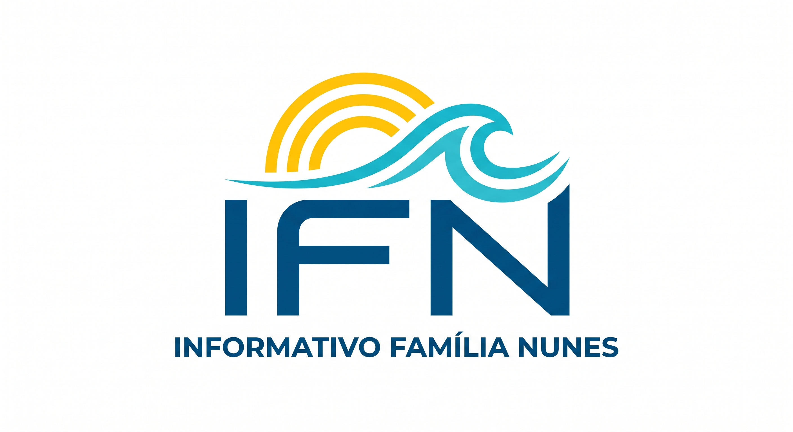

<!-- TÍTULO COM LOGO E RELÓGIO NO TOPO -->

Informativo Família Nunes

📅 Carregando data e hora...

<!-- CARD DE DIRETRIZES DO IFN -->

<strong>📌 Diretrizes do IFN (Fundado em 2026):</strong> 
  O IFN é o nosso mural digital familiar. O termo <em>Informativo</em> representa o nosso compromisso em compartilhar apenas o essencial para o dia a dia: meteorologia, música, saúde e conhecimento útil, sem exposição pessoal e isento de discussões políticas, religiosas ou esportivas.

<!-- 1ª CAIXA COMPACTA (PORTAL IFN) -->

<h3>Portal IFN</h3>

Welcome ao <strong>IFN</strong>! Consulta rápida diária de meteorologia, seleção musical, conhecimento e utilidades familiares.

<!-- DESTAQUE BOM PERFUME -->

<h3>✨ Bom Perfume — Beleza, Cosméticos & Perfumaria</h3>

Lançamentos de cosméticos, perfumes, maquiagens e skincare para todas as idades.

<a href="https://www.instagram.com/bomperfumeoficial?stkn=MTExNGxqdzd4MXR2aw%3D%3D&utm_source=qr" target="_blank" rel="noopener noreferrer" class="btn-instagram">📸 Conhecer @bomperfumeoficial</a>

<!-- SEÇÕES DO PORTAL -->

<!-- PREVISÃO DO TEMPO -->

<h3>🌤️ Previsão do Tempo</h3>

Boletins, vento e indicadores meteorológicos da região.

🌊 Rio Grande: Carregando...
🏛️ Pelotas: Carregando...

<a href="previsaodotempo.html" class="btn-ifn">Acessar Meteorologia</a>

<!-- ESPAÇO MÚSICA (MINIMALISTA E LIMPO) -->

<h3>🎵 Espaço Música</h3>

🎧 Novidade: Playlists de música e foco atualizadas!

<strong>🎸 Sugestão de Hoje:</strong> Carregando...

<a href="pagina3.html" class="btn-ifn">Acessar Música</a>

<!-- CONHECIMENTO & NOTÍCIAS (COM FOTO E RESUMO VISUAL) -->

<h3>💡 Conhecimento & Notícias</h3>

⚡ Destaque: Inovação, Tecnologia, Saúde e Dicas Diárias!

<strong>🌿 Dica de Hoje:</strong> Carregando...

<a href="noticias.html" class="btn-ifn">Acessar Conhecimento</a>

<strong>IFN</strong> — Canal Informativo Familiar (Fundado em 2026).

